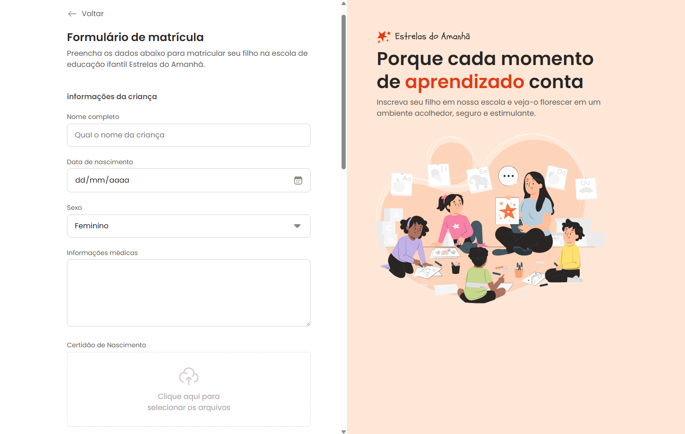

 

    

## 💻 Projeto
Esse é um projeto Webresponsivo feito com objetivo de aprender e aperfeiçoar a construção de formulários para o desenvolvimento web.

## 👩‍💻 Tecnologias
Esse projeto foi desenvolvido usando as seguintes tecnologias:

- HTML
- CSS
- GIT E Github